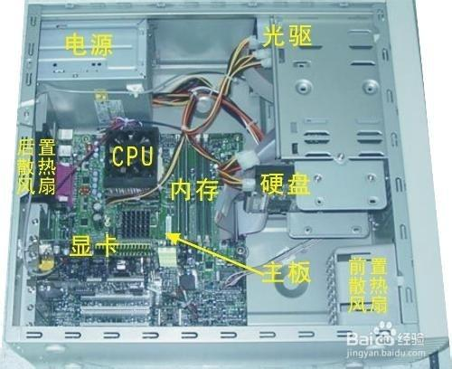
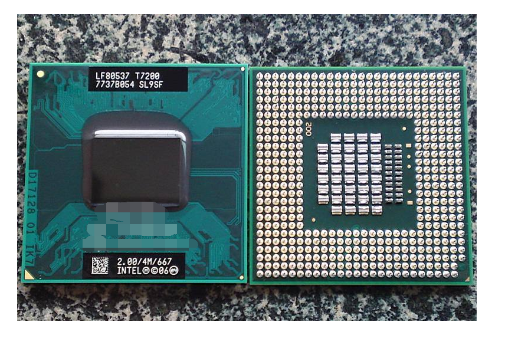
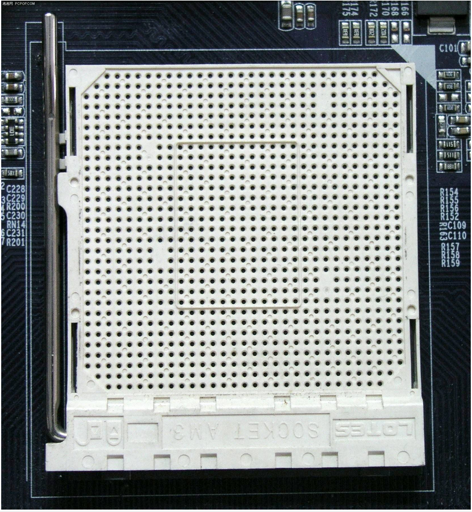

# 解说
一些可能是计算机组成原理的知识。首先要知道电脑所有的元件都只是电路，精巧的电路，极其精巧的电路。抽象掉物理构造之后实现了一定的逻辑功能。
 
## cpu
 
 
cpu的内部有ALU，可以加减乘除，可以与或非，通过构造电路，把输入的电信号变成对应的电信号，逻辑上就完成了四则运算。

cpu有一堆针脚(pin)，插在主板上对各种硬件发号施令。某几根针脚发出有电了，厂商规定这几根针脚应该解释为地址，于是下面的设备就认为cpu的地址总线发出了一个信号。cpu概念上有地址总线，控制总线和数据总线。比如要把xx位置的内存写成yy数据这个命令， "xx位置"，"写"，"yy数据"就分别从对应总线里发出。

cpu有若干寄存器，用来暂存一些数据，每个都有这样那样的固定功能。其中值得一提的是cs:ip两个寄存器。cpu的一般工作流程是：
1. 从cs:ip转换出一个内存地址，从那里读取一条二进制的指令
2. ip指向下一条指令
3. 执行
很巧妙的一点是2 和3 的顺序，有的指令是跳转指令，会修改cs:ip的值，这个顺序保证了跳转指令有可能实现，2和3反过来的话跳转修改的cs:ip就会被步骤2覆盖掉。

##主板
cpu经常会发出类似指令:读取xx地址的数据，或者把yy数据写入xx地址。这里问题来了，xx地址在哪里？一个寻址问题。
答案主板知道，cpu发出xx地址之后，接手的是主板，上面有南桥北桥各种总线各种接口。
一个地址不一定对应到内存，也可能是各种外设，显卡硬盘USB。cpu把指令发给主板，主板拿到指令看到地址，给你转发到需要的硬件上。
主板怎么知道硬件的地址？插在自己身上能不知道吗，主板上的插槽位置都是固定的。

## 启动过程
机器通电之后，各个硬件都有电了开始待命，其中的主角是cpu。cpu加电之后的一步初始化是 **cs:ip=f000:fff0**，这个位置主板认为是自己的ROM上的，从这个位置读到的数据对应的汇编指令是**jmp far f000:e05b**，是跳转指令，cs:ip跳到对应位置继续执行，执行的内容是一些初始化工作。
最后从硬盘中读出MBR，把MBR复制**0x7c00**，然后跳到**0x7c00**开始执行MBR的内容，此处开始终于我们可以介入了。

MBR在硬盘的哪里？**0盘0道1扇区**，是硬盘的第一个数据块。

怎么确定是个MBR？MBR规定应该是512byte，并且最后两byte是**0x55aa**。

## 轶事
为什么要从硬盘找？上一节讲到，我们设置了从硬盘启动，所以从硬盘找。如果换成u盘启动，那找的就是u盘了，如果是光盘启动软盘启动，那也是从对应地方找。不过此时就会有很有意思的事情发生，要能读u盘那你首先得能读u盘所以找MBR之前BIOS还得把类似USB驱动装上，光盘启动得光驱，当然硬盘启动也得有个硬盘驱动。
另一个细节是ROM其实很慢，所以ROM开头做的一件事往往是让自己能操作内存然后把ROM复制到内存里再做后面的事情。我觉得这个细节也好有意思，就记下来了。启动的时候资源紧缺，会发生很多事情呢。

## 魔数
上面有一堆标粗的数据，都是历史原因，爱考古的可以查查，除了当谈资，还可以了解远古时代的计算机厂商百家争鸣，各种不同规定的盛况。
顺便上面的规定一部分是x86的，一部分是硬件厂商的。所以也不完全是对的，各种厂商现在还可能有自己的规定，哪里发现到一个不同的规定的硬件也说不定。
感谢上帝这个小仓库只是要跑个os起来不用考虑那么多兼容性。